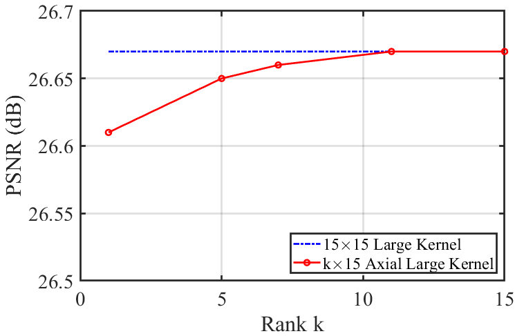

# Rebuttal for Paper ID 3044:

## Performance of Low rank
We report the performance results of low rank.
The large kernel size is $15\times 15$
It can be seen from Figure R1 that when k=1, the performance difference with full rank k=15 is in an acceptable range (0.06dB), which verifies the rationality of our ALK.

## Figure R1 (PSNR are evaluated in Urban100 $\times 4$):

## Performance of only one type operator.
FLOPs are maintained at about 40GFLOPs
## Table R1 (PSNR are evaluated in Urban100 $\times 4$):

| Operator  | PSNR  | FLOPs |
|-----------|-------|-------|
| ASP       | 26.64 | 41G   |
| Only MIB  | 26.27 | 40G   |
| Only LKA  | 26.51 | 40G   |
| Only ASSA | 26.56 | 42G   |
